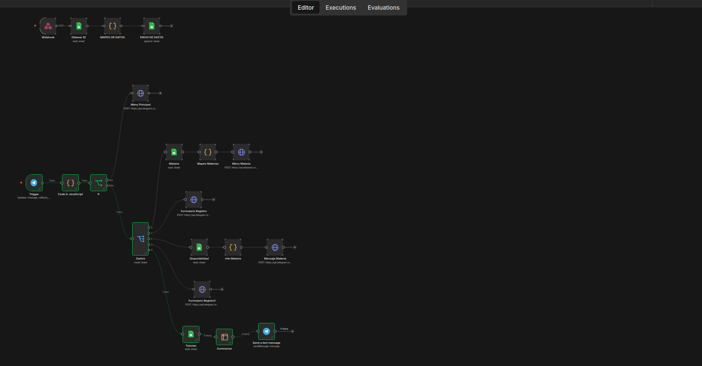

# Examen N8n Tutor Bot

# Explicacion 
En el nodo se hicieron nuevas modificaciones donde se agrego un nuevo boton en el menu principal llamado coordinacion. En el cual estamos filtrando
por la hoja de google sheet llamada tutorias para saber cuantas tutorias por semana hay de la misma materia, en el cual se hace un mensaje por materia
para saber el resumen total de esa materia o de todas las materias

## Boton nuevo en el menu 

## Resumen por materias 

## Flujo nuevo de n8n 

## Apartado que se agrego nuevo del flujo 
