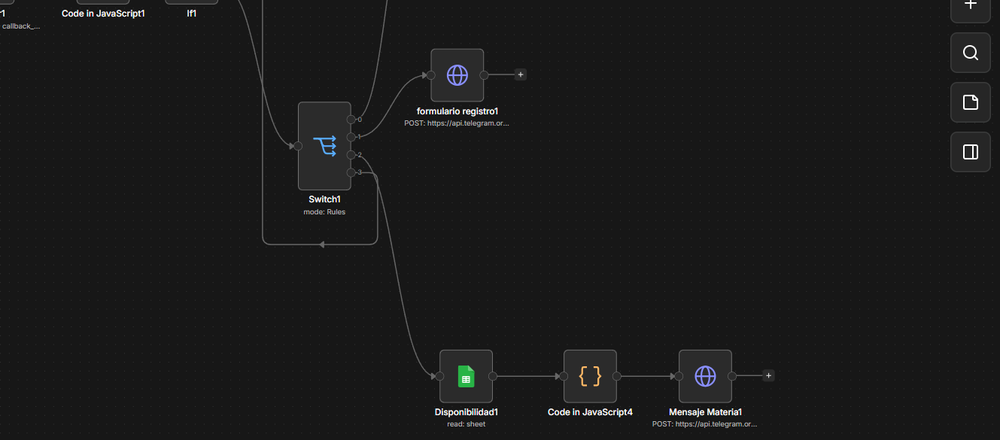
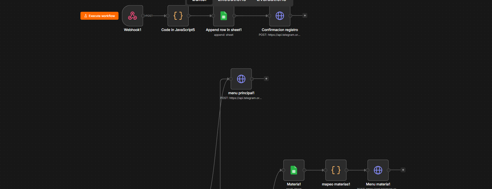
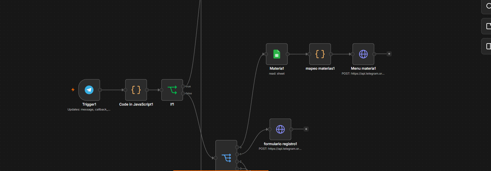

# Proyecto TutorBot 
## Colaboradores
- Jose Luis Tot Herrera
- Cleidy Priscila Pérez Casia

## Descripción
TutorBot es un asistente automatizado integrado con Telegram y Google Sheets que permite a los estudiantes gestionar tutorías académicas de forma interactiva.

### Características implementadas:
- **Solicitud de Tutorías:** Listado y mapeo de materias directamente desde Google Sheets.
- **Consulta de Estado:** Permite saber en qué proceso (Asignado/Confirmado) se encuentra el estudiante.
- **Cancelación en Tiempo Real:** Borrado físico de los datos del estudiante de la base de datos de Google al cancelar.
- **Navegación Intuitiva:** Botón "Regresar al Menú Principal" disponible en cada opción del flujo.

## Estructura de la Base de Datos (Google Sheets)
El acceso compartido está configurado para la lectura y escritura de las siguientes hojas:
1. **MATERIAS:** Lista de cursos ofertados.
2. **DISPONIBILIDAD:** Horarios, estados y costos.
3. **ESTUDIANTES:** Registro completo de solicitudes e inscripciones.

## Flujo del Sistema (Capturas de Pantalla)

## Enlace google sheet
https://docs.google.com/spreadsheets/d/1IZ8BCu-y5NRlnl16sVcEx1wXf97Av2ALpRipdb5V59M/edit?usp=sharing